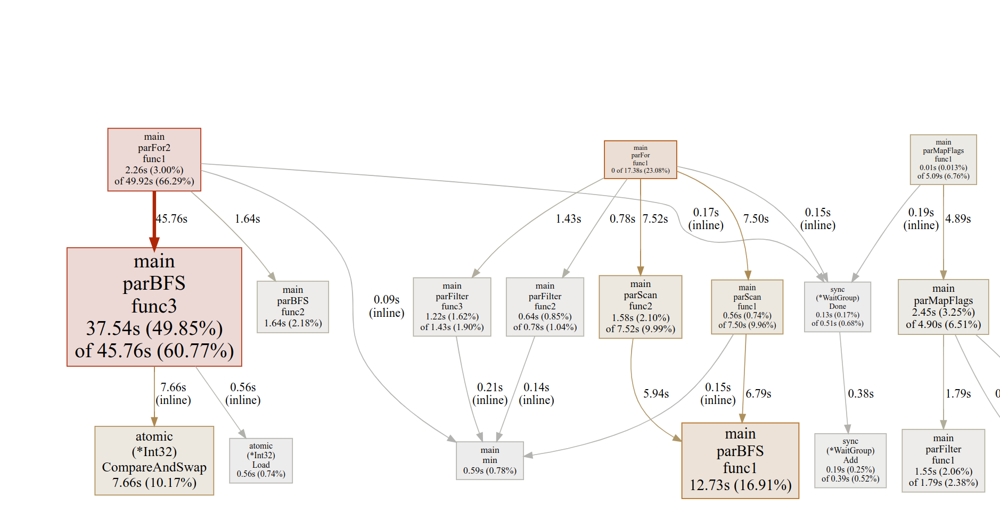

## Практическое задание 2, seq-par bfs

Весь код находится в одном файле - main.go.

#### Если у вас есть go

Чтобы запустить, нужно выполнить:

```
GOMAXPROCS=4 go run main.go par_processing.go
```

Убедиться, что GOMAXPROCS=4 действительно не дает сожрать больше 400% cpu, можно, открыв рядышком `top`.

#### Если у вас нет go

Я залил в репозиторий бинарничек, будем надеяться, что у вас тоже linux amd64:

```
GOMAXPROCS=4 ./seq-par-sort
```

## Полезная информация

- Я написал оба варианта: и reserve + commit, и CAS. Reserve + commit не особенно зашел, x2.1 выигрыш. CAS 
  после профилирования и танцов с бубном и оптимизацией памяти удалось довести до x2.8. 
- 

- Грязные примененные хаки:
    - если предположить, что степень вершины в графе максимальная и небольшая, можно значительно быстрее делать 
      parScan для подсчета сумм степеней вершин, не укладывая в кеш массив edges.
    - отключение GC для parallel BFS на время выполнения BFS (делать GC между тестами)


## Результаты:

#### Sequential BFS

```
❯ GOMAXPROCS=4 go run main.go par_processing.go
Sequential BFS, averaged over 5 launches

Launch 1: 43.047286164s
Launch 2: 43.473086417s
Launch 3: 42.779208801s
Launch 4: 44.191684002s
Launch 5: 43.966011356s

Average time: 43.491455348s
```

#### С хаком про максимальную степень:

```
❯ GOMAXPROCS=4 go run main.go par_processing.go
Parallel BFS, averaged over 5 launches

Launch 1: 15.656598924s
Launch 2: 15.277963863s
Launch 3: 15.439380054s
Launch 4: 15.219302314s
Launch 5: 16.035953028s

Average time: 15.525839636s
```

Выигрыш = 43.491455348 / 15.525839636 = 2.80


#### Без хака про максимальную степень
```
❯ GOMAXPROCS=4 go run main.go par_processing.go
Parallel BFS, averaged over 5 launches

Launch 1: 19.027554582s
Launch 2: 18.965844872s
Launch 3: 18.969120918s
Launch 4: 18.940746743s
Launch 5: 19.264979463s

Average time: 19.033649315s
```

Выигрыш = 43.491455348 / 19.033649315 = 2.28

